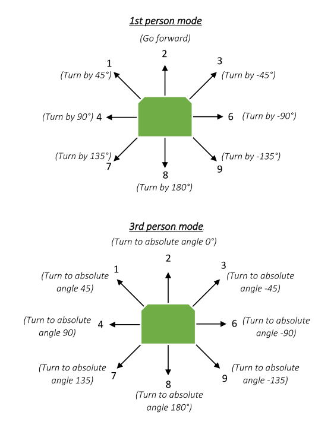

# Pionner_bci

ROS interface with bci system through sockets.

## How to use

### 1. Default use with a robot equiped with a lms1xx laser:
Execute the following line in the commandline:
```
$ roslaunch pioneer_bci bci_mover.launch
```
This will use the [pionner_bringup](https://github.com/amineHorseman/pioneer_bringup) package to load ROSARIA and the LMS1xx node.

### 2. Default use without using the lms1xx laser:
Execute the following line in the commandline:
```
$ roslaunch pioneer_bci bci_mover.launch lms1xx:=false
```
This will use the [pionner_bringup](https://github.com/amineHorseman/pioneer_bringup) package to load ROSARIA with a minimal mode.

### 3. Use with other types of robots:
The package should work with any type of ROS compatible robot as long as the right topics are specified.

See the section [More parameters](https://github.com/amineHorseman/pioneer_bci#parameters) for more information.

### 4. Use in simulation:
Execute the following lines in the commandline to launch a turtlebot3 simulation (need to have the turtlebot3 package installed):
```
$ export TURTLEBOT3_MODEL=burger
$ roslaunch pioneer_bci simulation.launch
```

## Commands

The bci_mover command will listen to a socket to recieve direct and speed commands. The format of the commands are two integers in the format `AB` where:
- A is the direction command (1 to 9)
- B is the speed command (1 to 5)

The following diagram show the output of the direction commands on the orientation of the robot:



The default direction mode is the 1st person mode, this can be changed to 3rd person mode by modifying the [config.py](https://github.com/amineHorseman/pioneer_bci/nodes/config.py) file

## Parameters

### 1. Roslaunch parameters:

Roslaunch files accept the following optional arguments.
- ip: socket address (default: localhost)
- port: socket port (default: 12347)
- cmd_vel_topic: name of the cmd_vel topic (default: cmd_vel)
- odom_topic: name of the odometry topic (default: odom)
- laser_topic: name of the laser scan topic (default: scan)
- lms1xx: Either to start LMS1xx node or not (default: true)

Example: 
```
$ roslaunch pioneer_bci bci_mover.launch ip:=192.168.1.1 port:=12347 cmd_vel_topic:=/robot1/cmd_vel
```

### 2. Other parameters:

More parameters can be configured in the [config.py](https://github.com/amineHorseman/pioneer_bci/nodes/config.py) file.

- angle_error: tolerence for the minium angle error in degrees (default 0.1°)
- move_distance: distance to move forward in meters (default 1)
- obstacle_min_distance: minimum distance for obstacle avoidance (default: 0.6)
- move_forward_at_each_move: Either to move forward after each turn, or only for the forward direction (default False)
- first_person_mode: Either to use the relative angles (1st person mode) or the absolute angles (3rd person mode) (default True)
- speed_reduce_factor: multiplying factor for reducing linear speed. Used to protect the robot from maximum speed (default 0.1)
- slow_down_distance: minimal distance to destination to start reducing speed. Used for avoiding drifting at stop (default 0.2)

## Testing

If you want to test the socket locally, launch the python script [test_socket.py](https://github.com/amineHorseman/pioneer_bci/nodes/test_socket.py)


## Experiments
Tested on ROS 1 Kinetic with P3DX and LMS1XX robot. Should work on all other Pionner-like robots using ROSARIA or P2OS.

Tested also on Gazebo with turtlebot3 simulation.

## Aknowledgement

Thanks to LARESI laboratory (University of Sciences and Technology of Oran) for providing the plateform for real-robot experimentations.
